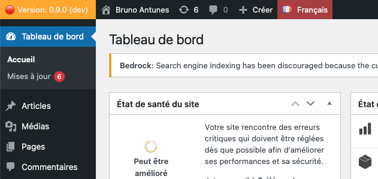

# bantunes-wp-admin-bar

Ajoutez des informations sur l'application, le système et l'environnement à la barre d'administration de votre site WordPress.

## Description

Ce plugin ajoute des informations sur votre application WordPress, votre système et votre environnement à la barre d'administration de WordPress. Il affiche les informations sur la dernière balise ou le dernier commit de votre dépôt Git, ainsi que la version PHP en cours d'exécution sur votre serveur.

## Installation

1. Téléchargez le plugin et extrayez le fichier zip.
2. Téléchargez le fichier dans le dossier `/wp-content/plugins/`.
3. Activez le plugin via le menu 'Extensions' de WordPress.

## Utilisation

Après avoir activé le plugin, vous verrez des informations supplémentaires sur votre application WordPress, votre système et votre environnement dans la barre d'administration de WordPress.

## Capture d'écran

## Journal des modifications

### 1.0.0
* Première version

## Licence

Ce plugin est distribué sous licence GPL2.

---
